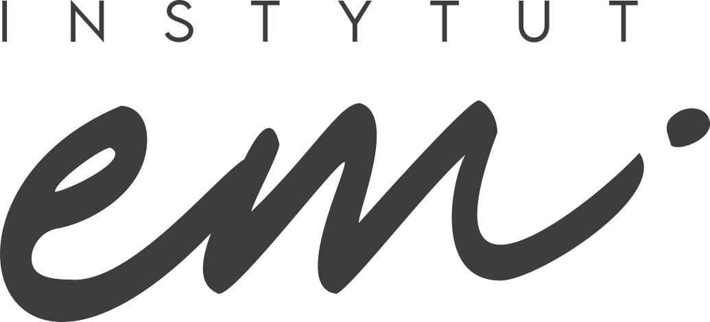

# Menu — podsumowanie i ostateczny kod

> Stan na 2026-08-27, po 19 rundach pracy nad menu (mega-menu w nagłówku, stopka, menu mobilne). Pełna, chronologiczna historia decyzji: [DOKUMENTACJA.md](DOKUMENTACJA.md).

## Podsumowanie ustaleń

**Struktura treści** — menu główne zastąpiło strukturę odziedziczoną 1:1 z archon.au (Skóra/Laser/Mężczyźni/Kobiety/O nas) nową, docelową strukturą instytutem.pl:

- **Konsultacje** — 2 kolumny: Dla Twarzy / Dla Ciała
- **Problem** — 2 kolumny: Na Twarzy / Na Ciele (kategoryzacja problem-based)
- **Zabiegi** — 3 kolumny: Zabiegi Hi-Tech / Zabiegi Iniekcyjne / Zabiegi Manualne
- **Cennik** — zwykły link, bez rozwijania
- **O nas** — 2 kolumny: Dla Klientów / O INSTYTUTem. (druga kategoria czeka na treść od klienta — obecnie jeden bezpieczny link zastępczy, oznaczony `TODO` w kodzie)
- **Kontakt** — zwykły link

Adresy linków: gdzie pozycja odpowiadała realnemu, już zaindeksowanemu URL-owi z instytutem.pl (np. `/zabiegi/depilacja-laserowa-plock-lightsheer`), użyto dokładnie tego adresu — reszta to nowe adresy w tej samej konwencji (kebab-case, polskie, bez `.html`).

**Styl mega-menu w nagłówku** — świadomie odwzorowany 1:1 z żywej archon.au (zmierzony bezpośrednio przez DOM, nie zgadywany):
- Panel zaczyna się dokładnie na dole 80px nagłówka (przyciski nav wypełniają całą jego wysokość).
- Hover linku = zmiana koloru na rdzawy `--a-rust` (`#C7642D`), bez podkreślenia.
- Otwarta pozycja menu głównego = cienka oliwkowa linia u dołu przycisku (`box-shadow: inset`).
- Mała strzałka (`::after`, maska CSS) pojawia się i przesuwa w prawo na hover linku; cały link też się lekko przesuwa (3px) — dokładnie jak na archon.au.
- Padding panelu `20px 48px 36px` (dolny celowo zwiększony ponad 1:1 dla lepszego balansu wizualnego — jedyne świadome odejście od czystej wierności).
- Szerokie panele (np. „Zabiegi”, 3 kolumny) pozycjonowane dynamicznie w JS, żeby zawsze mieściły się w viewport.

**Stopka** — tożsama z menu w nagłówku (te same linki i podkategorie), plus realne dane kontaktowe z instytutem.pl (telefon, e-mail, adres z Google Maps, godziny, social media). 5 kolumn w jednym wierszu do 1024px, potem logo nad 4 kolumnami menu.

**Menu mobilne** — przebudowane, żeby wizualnie i strukturalnie odpowiadało realnemu mobilnemu menu archon.au (zmierzone bezpośrednio: `padding:30px 0`, `font-size:16px/line-height:24px/letter-spacing:.5px`, linia-separator `rgba(202,199,192,.16)`, 3 przyciski CTA Zadzwoń/Rezerwuj online/Kup Voucher):
- **Jeden, wspólny przełącznik** — hamburger w nagłówku zamienia się w X i zamyka menu ponownym kliknięciem. Usunięty został duplikat (osobne logo + X wewnątrz panelu), bo przykrywał prawdziwy hamburger i uniemożliwiał zobaczenie animacji X.
- Panel wysuwa się **z pod nagłówka** (`top:80px`, `transform:translateY(-100%→0)`), a nie z prawej strony na pełnym ekranie.
- Pozycje najwyższego poziomu (16px) wyraźnie większe niż podkategorie po rozwinięciu (14px) — naturalna hierarchia.
- Menu automatycznie się zamyka, jeśli okno zostanie rozszerzone do szerokości desktop (wcześniej zostawało otwarte i zablokowane, bez możliwości zamknięcia).
- Rdzawy hover na wszystkich linkach, łącznie z zagnieżdżonymi podkategoriami.

## Ostateczny kod

```html
<!-- ============================================================
     HEADER — nawigacja desktopowa + mega-menu + hamburger
     ============================================================ -->
<header class="site-nav" id="siteNav">
  <div class="container nav-row">
    <a class="logo" href="index.html"></a>

    <div class="nav-right">
    <nav aria-label="Główna">
      <ul class="nav-links">
        <li>
          <button class="nav-link" id="konsultacjeMenuBtn" aria-expanded="false" aria-controls="konsultacjeMegaPanel">
            <span class="nav-type">Konsultacje</span><svg class="caret" viewBox="0 0 10 6" fill="none" aria-hidden="true"><path d="M1 1L5 5L9 1" stroke="currentColor" stroke-width="1.4" stroke-linecap="round" stroke-linejoin="round"/></svg>
          </button>
          <div class="mega-panel" id="konsultacjeMegaPanel" hidden>
            <div class="mega-group">
              <div class="cat">Dla Twarzy</div>
              <ul>
                <li><a href="/konsultacje/dermokonsultacja-twarz">Dermokonsultacja (twarz)</a></li>
                <li><a href="/konsultacje/konsultacja-zabiegowa-twarz">Konsultacja zabiegowa</a></li>
                <li><a href="/konsultacje/wizyta-kontrolna-twarz">Wizyta kontrolna</a></li>
                <li><a href="/konsultacje/konsultacja-trychologiczna">Konsultacja trychologiczna</a></li>
              </ul>
            </div>
            <div class="mega-group">
              <div class="cat">Dla Ciała</div>
              <ul>
                <li><a href="/konsultacje/dermokonsultacja-cialo">Dermokonsultacja (ciało)</a></li>
                <li><a href="/konsultacje/konsultacja-zabiegowa-cialo">Konsultacja zabiegowa</a></li>
                <li><a href="/konsultacje/wizyta-kontrolna-cialo">Wizyta kontrolna</a></li>
              </ul>
            </div>
          </div>
        </li>
        <li>
          <button class="nav-link" id="problemMenuBtn" aria-expanded="false" aria-controls="problemMegaPanel">
            <span class="nav-type">Problem</span><svg class="caret" viewBox="0 0 10 6" fill="none" aria-hidden="true"><path d="M1 1L5 5L9 1" stroke="currentColor" stroke-width="1.4" stroke-linecap="round" stroke-linejoin="round"/></svg>
          </button>
          <div class="mega-panel" id="problemMegaPanel" hidden>
            <div class="mega-group">
              <div class="cat">Na Twarzy</div>
              <ul>
                <li><a href="/problem/zmarszczki-i-utrata-jedrnosci">Zmarszczki i utrata jędrności</a></li>
                <li><a href="/problem/utrata-blasku-i-ziemista-cera">Utrata blasku i ziemista cera</a></li>
                <li><a href="/problem/przebarwienia">Przebarwienia</a></li>
                <li><a href="/problem/tradzik-i-niedoskonalosci">Trądzik i niedoskonałości</a></li>
                <li><a href="/problem/skora-wrazliwa-i-naczyniowa">Skóra wrażliwa i naczyniowa</a></li>
                <li><a href="/problem/suchosc-i-odwodnienie">Suchość i odwodnienie</a></li>
                <li><a href="/problem/skora-dojrzala">Skóra dojrzała</a></li>
                <li><a href="/problem/opadajacy-owal-twarzy">Opadający owal twarzy</a></li>
              </ul>
            </div>
            <div class="mega-group">
              <div class="cat">Na Ciele</div>
              <ul>
                <li><a href="/problem/cellulit">Cellulit</a></li>
                <li><a href="/problem/wiotka-skora">Wiotka skóra</a></li>
                <li><a href="/problem/nadmiar-tkanki-tluszczowej">Nadmiar tkanki tłuszczowej</a></li>
                <li><a href="/problem/rozstepy">Rozstępy</a></li>
                <li><a href="/problem/nadmierne-owlosienie">Nadmierne owłosienie</a></li>
                <li><a href="/problem/retencja-wody-i-obrzeki">Retencja wody i obrzęki</a></li>
                <li><a href="/problem/blizny">Blizny</a></li>
                <li><a href="/problem/utrata-jedrnosci-biustu">Utrata jędrności biustu</a></li>
              </ul>
            </div>
          </div>
        </li>
        <li>
          <button class="nav-link" id="zabiegiMenuBtn" aria-expanded="false" aria-controls="zabiegiMegaPanel">
            <span class="nav-type">Zabiegi</span><svg class="caret" viewBox="0 0 10 6" fill="none" aria-hidden="true"><path d="M1 1L5 5L9 1" stroke="currentColor" stroke-width="1.4" stroke-linecap="round" stroke-linejoin="round"/></svg>
          </button>
          <div class="mega-panel" id="zabiegiMegaPanel" hidden>
            <div class="mega-group">
              <div class="cat">Zabiegi Hi-Tech</div>
              <ul>
                <li><a href="/zabiegi/depilacja-laserowa-plock-lightsheer">Epilacja laserowa LightSheer®</a></li>
                <li><a href="/laser-tulowy-plock">Laser Tulowy Erbowo-Szklany</a></li>
                <li><a href="/zabiegi/endermologia-plock-lpg-alliance">Endermologia LPG® Alliance</a></li>
                <li><a href="/zabiegi/lpg-ergolift">LPG® Ergolift</a></li>
                <li><a href="/zabiegi/kriolipoliza-plock-cooltech">Kriolipoliza cooltech®</a></li>
                <li><a href="/zabiegi/bloomea">Bloomea®</a></li>
                <li><a href="/zabiegi/oczyszczanie-wodorowe-plock">Oczyszczanie wodorowe</a></li>
                <li><a href="/fototerapia-dermalux-plock">Fototerapia LED Dermalux®</a></li>
                <li><a href="/zabiegi/plasma">Plasma™</a></li>
                <li><a href="/radiofrekwencja-mikroiglowa-plock">Radiofrekwencja mikroigłowa RF</a></li>
                <li><a href="/zabiegi/dermapen-plock-mikronakluwanie">Mikronakłuwanie SkinPen®</a></li>
              </ul>
            </div>
            <div class="mega-group">
              <div class="cat">Zabiegi Iniekcyjne</div>
              <ul>
                <li><a href="/zabiegi/autologiczne-wypelniacze-atr">Autologiczne wypełniacze ATR</a></li>
                <li><a href="/zabiegi/kwas-polimlekowy-plla">Kwas polimlekowy PLLA</a></li>
                <li><a href="/zabiegi/mezoterapia-iglowa-plock">Mezoterapia igłowa</a></li>
                <li><a href="/zabiegi/wypelnianie-kwasem-hialuronowym-plock">Kwas hialuronowy</a></li>
                <li><a href="/zabiegi/nici-liftinguj%C4%85ce-pdo">Nici liftingujące PDO/PLLA</a></li>
                <li><a href="/fibryna-i-osocze-bogatoplytkowe">Fibryna i osocze bogatopłytkowe</a></li>
                <li><a href="/zabiegi/stymulatory-tkankowe">Stymulatory tkankowe</a></li>
                <li><a href="/zabiegi/lipoliza-iniekcyjna-plock">Lipoliza Iniekcyjna</a></li>
                <li><a href="/zabiegi/karboksyterapia-plock">Karboksyterapia</a></li>
              </ul>
            </div>
            <div class="mega-group">
              <div class="cat">Zabiegi Manualne</div>
              <ul>
                <li><a href="/zabiegi/mezoterapia-mikroiglowa">Mezoterapia mikroigłowa</a></li>
                <li><a href="/zabiegi/mezoterapia-bezig%C5%82owa">Mezoterapia bezigłowa</a></li>
                <li><a href="/zabiegi/mikrodermabrazja">Mikrodermabrazja</a></li>
                <li><a href="/zabiegi/peelingi-medyczne">Peelingi medyczne/chemiczne</a></li>
              </ul>
            </div>
          </div>
        </li>
        <li><a class="nav-link" href="/cennik"><span class="nav-type">Cennik</span></a></li>
        <li>
          <button class="nav-link" id="onasMenuBtn" aria-expanded="false" aria-controls="onasMegaPanel">
            <span class="nav-type">O nas</span><svg class="caret" viewBox="0 0 10 6" fill="none" aria-hidden="true"><path d="M1 1L5 5L9 1" stroke="currentColor" stroke-width="1.4" stroke-linecap="round" stroke-linejoin="round"/></svg>
          </button>
          <div class="mega-panel" id="onasMegaPanel" hidden>
            <div class="mega-group">
              <div class="cat">Dla Klientów</div>
              <ul>
                <li><a href="/promocje">Aktualne promocje</a></li>
                <li><a href="/program-lojalnosciowy">Program lojalnościowy</a></li>
                <li><a href="/vouchery">Vouchery podarunkowe</a></li>
              </ul>
            </div>
            <div class="mega-group">
              <div class="cat">O INSTYTUTem.</div>
              <ul>
                <!-- TODO: treść tej kategorii do potwierdzenia z użytkownikiem — w dostarczonej treści była identyczna z "Dla Klientów", co wygląda na błąd kopiuj-wklej ze źródła. Tymczasowo jeden bezpieczny link do ogólnej strony "O nas". -->
                <li><a href="/o-nas">O nas</a></li>
              </ul>
            </div>
          </div>
        </li>
        <li><a class="nav-link" href="/kontakt"><span class="nav-type">Kontakt</span></a></li>
      </ul>
    </nav>

    <div class="nav-ctas">
      <a class="abtn primary-olive" href="https://rezerwuj.instytutem.pl" target="_blank" rel="noopener">Rezerwuj online</a>
      <a class="abtn outline-dark" href="/vouchery">Kup Voucher</a>
    </div>
    </div>

    <button class="hamburger" id="hamburgerBtn" aria-expanded="false" aria-controls="mobileDrawer" aria-label="Otwórz menu">
      <span></span><span></span><span></span>
    </button>
  </div>
</header>

<!-- ============================================================
     MENU MOBILNE — wysuwa się z pod nagłówka (top:80px), jeden
     wspólny przełącznik (hamburgerBtn), bez duplikatu logo/X
     ============================================================ -->
<div class="mobile-drawer" id="mobileDrawer" hidden>
  <nav aria-label="Mobilna">
    <ul>
      <li>
        <details>
          <summary class="nav-link"><span class="nav-type">Konsultacje</span><svg class="caret" viewBox="0 0 10 6" fill="none" aria-hidden="true"><path d="M1 1L5 5L9 1" stroke="currentColor" stroke-width="1.4" stroke-linecap="round" stroke-linejoin="round"/></svg></summary>
          <ul>
            <li class="cat-label">Dla Twarzy</li>
            <li><a href="/konsultacje/dermokonsultacja-twarz">Dermokonsultacja (twarz)</a></li>
            <li><a href="/konsultacje/konsultacja-zabiegowa-twarz">Konsultacja zabiegowa</a></li>
            <li><a href="/konsultacje/wizyta-kontrolna-twarz">Wizyta kontrolna</a></li>
            <li><a href="/konsultacje/konsultacja-trychologiczna">Konsultacja trychologiczna</a></li>
            <li class="cat-label">Dla Ciała</li>
            <li><a href="/konsultacje/dermokonsultacja-cialo">Dermokonsultacja (ciało)</a></li>
            <li><a href="/konsultacje/konsultacja-zabiegowa-cialo">Konsultacja zabiegowa</a></li>
            <li><a href="/konsultacje/wizyta-kontrolna-cialo">Wizyta kontrolna</a></li>
          </ul>
        </details>
      </li>
      <li>
        <details>
          <summary class="nav-link"><span class="nav-type">Problem</span><svg class="caret" viewBox="0 0 10 6" fill="none" aria-hidden="true"><path d="M1 1L5 5L9 1" stroke="currentColor" stroke-width="1.4" stroke-linecap="round" stroke-linejoin="round"/></svg></summary>
          <ul>
            <li class="cat-label">Na Twarzy</li>
            <li><a href="/problem/zmarszczki-i-utrata-jedrnosci">Zmarszczki i utrata jędrności</a></li>
            <li><a href="/problem/utrata-blasku-i-ziemista-cera">Utrata blasku i ziemista cera</a></li>
            <li><a href="/problem/przebarwienia">Przebarwienia</a></li>
            <li><a href="/problem/tradzik-i-niedoskonalosci">Trądzik i niedoskonałości</a></li>
            <li><a href="/problem/skora-wrazliwa-i-naczyniowa">Skóra wrażliwa i naczyniowa</a></li>
            <li><a href="/problem/suchosc-i-odwodnienie">Suchość i odwodnienie</a></li>
            <li><a href="/problem/skora-dojrzala">Skóra dojrzała</a></li>
            <li><a href="/problem/opadajacy-owal-twarzy">Opadający owal twarzy</a></li>
            <li class="cat-label">Na Ciele</li>
            <li><a href="/problem/cellulit">Cellulit</a></li>
            <li><a href="/problem/wiotka-skora">Wiotka skóra</a></li>
            <li><a href="/problem/nadmiar-tkanki-tluszczowej">Nadmiar tkanki tłuszczowej</a></li>
            <li><a href="/problem/rozstepy">Rozstępy</a></li>
            <li><a href="/problem/nadmierne-owlosienie">Nadmierne owłosienie</a></li>
            <li><a href="/problem/retencja-wody-i-obrzeki">Retencja wody i obrzęki</a></li>
            <li><a href="/problem/blizny">Blizny</a></li>
            <li><a href="/problem/utrata-jedrnosci-biustu">Utrata jędrności biustu</a></li>
          </ul>
        </details>
      </li>
      <li>
        <details>
          <summary class="nav-link"><span class="nav-type">Zabiegi</span><svg class="caret" viewBox="0 0 10 6" fill="none" aria-hidden="true"><path d="M1 1L5 5L9 1" stroke="currentColor" stroke-width="1.4" stroke-linecap="round" stroke-linejoin="round"/></svg></summary>
          <ul>
            <li class="cat-label">Zabiegi Hi-Tech</li>
            <li><a href="/zabiegi/depilacja-laserowa-plock-lightsheer">Epilacja laserowa LightSheer®</a></li>
            <li><a href="/laser-tulowy-plock">Laser Tulowy Erbowo-Szklany</a></li>
            <li><a href="/zabiegi/endermologia-plock-lpg-alliance">Endermologia LPG® Alliance</a></li>
            <li><a href="/zabiegi/lpg-ergolift">LPG® Ergolift</a></li>
            <li><a href="/zabiegi/kriolipoliza-plock-cooltech">Kriolipoliza cooltech®</a></li>
            <li><a href="/zabiegi/bloomea">Bloomea®</a></li>
            <li><a href="/zabiegi/oczyszczanie-wodorowe-plock">Oczyszczanie wodorowe</a></li>
            <li><a href="/fototerapia-dermalux-plock">Fototerapia LED Dermalux®</a></li>
            <li><a href="/zabiegi/plasma">Plasma™</a></li>
            <li><a href="/radiofrekwencja-mikroiglowa-plock">Radiofrekwencja mikroigłowa RF</a></li>
            <li><a href="/zabiegi/dermapen-plock-mikronakluwanie">Mikronakłuwanie SkinPen®</a></li>
            <li class="cat-label">Zabiegi Iniekcyjne</li>
            <li><a href="/zabiegi/autologiczne-wypelniacze-atr">Autologiczne wypełniacze ATR</a></li>
            <li><a href="/zabiegi/kwas-polimlekowy-plla">Kwas polimlekowy PLLA</a></li>
            <li><a href="/zabiegi/mezoterapia-iglowa-plock">Mezoterapia igłowa</a></li>
            <li><a href="/zabiegi/wypelnianie-kwasem-hialuronowym-plock">Kwas hialuronowy</a></li>
            <li><a href="/zabiegi/nici-liftinguj%C4%85ce-pdo">Nici liftingujące PDO/PLLA</a></li>
            <li><a href="/fibryna-i-osocze-bogatoplytkowe">Fibryna i osocze bogatopłytkowe</a></li>
            <li><a href="/zabiegi/stymulatory-tkankowe">Stymulatory tkankowe</a></li>
            <li><a href="/zabiegi/lipoliza-iniekcyjna-plock">Lipoliza Iniekcyjna</a></li>
            <li><a href="/zabiegi/karboksyterapia-plock">Karboksyterapia</a></li>
            <li class="cat-label">Zabiegi Manualne</li>
            <li><a href="/zabiegi/mezoterapia-mikroiglowa">Mezoterapia mikroigłowa</a></li>
            <li><a href="/zabiegi/mezoterapia-bezig%C5%82owa">Mezoterapia bezigłowa</a></li>
            <li><a href="/zabiegi/mikrodermabrazja">Mikrodermabrazja</a></li>
            <li><a href="/zabiegi/peelingi-medyczne">Peelingi medyczne/chemiczne</a></li>
          </ul>
        </details>
      </li>
      <li><a class="nav-link" href="/cennik"><span class="nav-type">Cennik</span></a></li>
      <li>
        <details>
          <summary class="nav-link"><span class="nav-type">O nas</span><svg class="caret" viewBox="0 0 10 6" fill="none" aria-hidden="true"><path d="M1 1L5 5L9 1" stroke="currentColor" stroke-width="1.4" stroke-linecap="round" stroke-linejoin="round"/></svg></summary>
          <ul>
            <li class="cat-label">Dla Klientów</li>
            <li><a href="/promocje">Aktualne promocje</a></li>
            <li><a href="/program-lojalnosciowy">Program lojalnościowy</a></li>
            <li><a href="/vouchery">Vouchery podarunkowe</a></li>
            <li class="cat-label">O INSTYTUTem.</li>
            <!-- TODO: jak w wersji desktopowej — treść tej kategorii do potwierdzenia, dostarczona treść była duplikatem "Dla Klientów" -->
            <li><a href="/o-nas">O nas</a></li>
          </ul>
        </details>
      </li>
      <li><a class="nav-link" href="/kontakt"><span class="nav-type">Kontakt</span></a></li>
    </ul>
  </nav>
  <div class="drawer-ctas">
    <a class="abtn outline-gray" href="tel:+48737836092">Zadzwoń</a>
    <a class="abtn primary-olive" href="https://rezerwuj.instytutem.pl" target="_blank" rel="noopener">Rezerwuj online</a>
    <a class="abtn outline-dark" href="/vouchery">Kup Voucher</a>
  </div>
</div>

<!-- ============================================================
     STOPKA — te same pozycje i linki co menu w nagłówku,
     realne dane kontaktowe z instytutem.pl
     ============================================================ -->
<footer class="site-footer section--cream">
  <div class="container section-pad">
    <div class="footer-grid">
      <div class="footer-col">
        <div class="logo" style="margin-bottom:1rem"></div>
        <a class="contact-value" href="tel:+48737836092" style="display:block">+48 737 836 092</a>
        <a class="contact-value" href="mailto:recepcja@instytutem.pl" style="display:block;margin-top:.5rem">recepcja@instytutem.pl</a>
        <a class="contact-value" href="https://goo.gl/maps/upRkkPpan7BiD86L9" target="_blank" rel="noopener" style="display:block;margin-top:.5rem">ul. 1 Maja 6, 09-402 Płock</a>
        <p style="margin-top:.75rem;font-size:.8rem;color:var(--a-gray)">
          pon–pt: 08:00–21:00<br>sob: 08:00–16:00<br>niedziela: nieczynne
        </p>
        <div class="footer-social">
          <a href="https://www.facebook.com/instytutem" target="_blank" rel="noopener" aria-label="INSTYTUTem na Facebooku">
            <svg width="18" height="18" viewBox="0 0 24 24" fill="currentColor" aria-hidden="true"><path d="M22 12.06C22 6.5 17.52 2 12 2S2 6.5 2 12.06c0 5 3.66 9.15 8.44 9.94v-7.03H7.9v-2.91h2.54V9.85c0-2.51 1.49-3.89 3.77-3.89 1.09 0 2.24.2 2.24.2v2.46h-1.26c-1.24 0-1.63.77-1.63 1.56v1.88h2.78l-.45 2.91h-2.33V22c4.78-.79 8.44-4.94 8.44-9.94Z"/></svg>
          </a>
          <a href="https://www.instagram.com/instytutem/" target="_blank" rel="noopener" aria-label="INSTYTUTem na Instagramie">
            <svg width="18" height="18" viewBox="0 0 24 24" fill="none" stroke="currentColor" stroke-width="1.6" aria-hidden="true"><rect x="3" y="3" width="18" height="18" rx="5"/><circle cx="12" cy="12" r="4"/><circle cx="17.2" cy="6.8" r="1"/></svg>
          </a>
        </div>
      </div>

      <div class="footer-col">
        <h4>Konsultacje</h4>
        <ul>
          <li class="cat-label">Dla Twarzy</li>
          <li><a href="/konsultacje/dermokonsultacja-twarz">Dermokonsultacja (twarz)</a></li>
          <li><a href="/konsultacje/konsultacja-zabiegowa-twarz">Konsultacja zabiegowa</a></li>
          <li><a href="/konsultacje/wizyta-kontrolna-twarz">Wizyta kontrolna</a></li>
          <li><a href="/konsultacje/konsultacja-trychologiczna">Konsultacja trychologiczna</a></li>
          <li class="cat-label">Dla Ciała</li>
          <li><a href="/konsultacje/dermokonsultacja-cialo">Dermokonsultacja (ciało)</a></li>
          <li><a href="/konsultacje/konsultacja-zabiegowa-cialo">Konsultacja zabiegowa</a></li>
          <li><a href="/konsultacje/wizyta-kontrolna-cialo">Wizyta kontrolna</a></li>
        </ul>
      </div>

      <div class="footer-col">
        <h4>Problem</h4>
        <ul>
          <li class="cat-label">Na Twarzy</li>
          <li><a href="/problem/zmarszczki-i-utrata-jedrnosci">Zmarszczki i utrata jędrności</a></li>
          <li><a href="/problem/utrata-blasku-i-ziemista-cera">Utrata blasku i ziemista cera</a></li>
          <li><a href="/problem/przebarwienia">Przebarwienia</a></li>
          <li><a href="/problem/tradzik-i-niedoskonalosci">Trądzik i niedoskonałości</a></li>
          <li><a href="/problem/skora-wrazliwa-i-naczyniowa">Skóra wrażliwa i naczyniowa</a></li>
          <li><a href="/problem/suchosc-i-odwodnienie">Suchość i odwodnienie</a></li>
          <li><a href="/problem/skora-dojrzala">Skóra dojrzała</a></li>
          <li><a href="/problem/opadajacy-owal-twarzy">Opadający owal twarzy</a></li>
          <li class="cat-label">Na Ciele</li>
          <li><a href="/problem/cellulit">Cellulit</a></li>
          <li><a href="/problem/wiotka-skora">Wiotka skóra</a></li>
          <li><a href="/problem/nadmiar-tkanki-tluszczowej">Nadmiar tkanki tłuszczowej</a></li>
          <li><a href="/problem/rozstepy">Rozstępy</a></li>
          <li><a href="/problem/nadmierne-owlosienie">Nadmierne owłosienie</a></li>
          <li><a href="/problem/retencja-wody-i-obrzeki">Retencja wody i obrzęki</a></li>
          <li><a href="/problem/blizny">Blizny</a></li>
          <li><a href="/problem/utrata-jedrnosci-biustu">Utrata jędrności biustu</a></li>
        </ul>
      </div>

      <div class="footer-col">
        <h4>Zabiegi</h4>
        <ul>
          <li class="cat-label">Zabiegi Hi-Tech</li>
          <li><a href="/zabiegi/depilacja-laserowa-plock-lightsheer">Epilacja laserowa LightSheer®</a></li>
          <li><a href="/laser-tulowy-plock">Laser Tulowy Erbowo-Szklany</a></li>
          <li><a href="/zabiegi/endermologia-plock-lpg-alliance">Endermologia LPG® Alliance</a></li>
          <li><a href="/zabiegi/lpg-ergolift">LPG® Ergolift</a></li>
          <li><a href="/zabiegi/kriolipoliza-plock-cooltech">Kriolipoliza cooltech®</a></li>
          <li><a href="/zabiegi/bloomea">Bloomea®</a></li>
          <li><a href="/zabiegi/oczyszczanie-wodorowe-plock">Oczyszczanie wodorowe</a></li>
          <li><a href="/fototerapia-dermalux-plock">Fototerapia LED Dermalux®</a></li>
          <li><a href="/zabiegi/plasma">Plasma™</a></li>
          <li><a href="/radiofrekwencja-mikroiglowa-plock">Radiofrekwencja mikroigłowa RF</a></li>
          <li><a href="/zabiegi/dermapen-plock-mikronakluwanie">Mikronakłuwanie SkinPen®</a></li>
          <li class="cat-label">Zabiegi Iniekcyjne</li>
          <li><a href="/zabiegi/autologiczne-wypelniacze-atr">Autologiczne wypełniacze ATR</a></li>
          <li><a href="/zabiegi/kwas-polimlekowy-plla">Kwas polimlekowy PLLA</a></li>
          <li><a href="/zabiegi/mezoterapia-iglowa-plock">Mezoterapia igłowa</a></li>
          <li><a href="/zabiegi/wypelnianie-kwasem-hialuronowym-plock">Kwas hialuronowy</a></li>
          <li><a href="/zabiegi/nici-liftinguj%C4%85ce-pdo">Nici liftingujące PDO/PLLA</a></li>
          <li><a href="/fibryna-i-osocze-bogatoplytkowe">Fibryna i osocze bogatopłytkowe</a></li>
          <li><a href="/zabiegi/stymulatory-tkankowe">Stymulatory tkankowe</a></li>
          <li><a href="/zabiegi/lipoliza-iniekcyjna-plock">Lipoliza Iniekcyjna</a></li>
          <li><a href="/zabiegi/karboksyterapia-plock">Karboksyterapia</a></li>
          <li class="cat-label">Zabiegi Manualne</li>
          <li><a href="/zabiegi/mezoterapia-mikroiglowa">Mezoterapia mikroigłowa</a></li>
          <li><a href="/zabiegi/mezoterapia-bezig%C5%82owa">Mezoterapia bezigłowa</a></li>
          <li><a href="/zabiegi/mikrodermabrazja">Mikrodermabrazja</a></li>
          <li><a href="/zabiegi/peelingi-medyczne">Peelingi medyczne/chemiczne</a></li>
        </ul>
      </div>

      <div class="footer-col">
        <h4>O nas</h4>
        <ul>
          <li class="cat-label">Dla Klientów</li>
          <li><a href="/promocje">Aktualne promocje</a></li>
          <li><a href="/program-lojalnosciowy">Program lojalnościowy</a></li>
          <li><a href="/vouchery">Vouchery podarunkowe</a></li>
          <li class="cat-label">O INSTYTUTem.</li>
          <!-- TODO: jak w menu głównym — treść tej kategorii do potwierdzenia z użytkownikiem -->
          <li><a href="/o-nas">O nas</a></li>
          <li class="cat-label">Więcej</li>
          <li><a href="/cennik">Cennik</a></li>
          <li><a href="/kontakt">Kontakt</a></li>
        </ul>
      </div>
    </div>

    <div class="footer-bottom">
      <span>© <span id="year"></span> INSTYTUTem.™ Wszelkie prawa zastrzeżone.</span>
      <span><a href="https://www.instytutem.pl/polityka-prywatno%C5%9Bci" target="_blank" rel="noopener">Polityka Prywatności</a></span>
    </div>
  </div>
</footer>

<style>
/* ============================================================
   TOKENY — zmienne kolorów i odstępów użyte przez menu
   (pełna paleta marki: DESIGN-SYSTEM.md §2)
   ============================================================ */
:root{
  --a-cream:#F1EDE7;
  --a-olive-black:#161810;
  --a-olive:#3A412A;
  --a-olive-deep:#232715;
  --a-ink-warm:#3F3D3B;
  --a-border-gray:#696969;
  --a-gray:#7A7772;
  --a-taupe:#D6D0C5;
  --a-white:#FFFFFF;
  --a-rust:#C7642D;
  --sp-16:16px;
  --sp-24:24px;
  --sp-40:40px;
  --sp-64:64px;
  --container-max:1440px;
}

/* ============================================================
   RESET / PODSTAWY wymagane przez menu
   ============================================================ */
*,*::before,*::after{ box-sizing:border-box; }
a{ color:inherit; text-decoration:none; }
button{ font-family:inherit; cursor:pointer; border:0; background:none; padding:0; }
ul{ margin:0; padding:0; list-style:none; }
.container{ max-width:var(--container-max); margin:0 auto; padding:0 clamp(20px, 5%, 72px); }
.nav-type{ font-family:"Inter",sans-serif; font-weight:500; font-size:14px; }

/* ============================================================
   PRZYCISKI (warianty użyte w CTA menu / stopki)
   ============================================================ */
.abtn{
  display:inline-flex; align-items:center; justify-content:center;
  height:44px; padding:0 27px;
  font-family:"Inter",sans-serif; font-size:.875rem; font-weight:500; white-space:nowrap;
  border-radius:2px; border:0;
  transition:transform .3s cubic-bezier(.25,.46,.45,.94), box-shadow .3s cubic-bezier(.25,.46,.45,.94);
}
.abtn:hover{ transform:translateY(-8px); box-shadow:0 9px 11px -2px rgba(0,0,0,.38); }
.abtn.primary-olive{ background:var(--a-olive); color:var(--a-cream); border-radius:3px; padding:0 23px; }
.abtn.outline-dark{ background:transparent; color:var(--a-olive-deep); border:1px solid var(--a-olive-deep); border-radius:3px; padding:0 23px; }
.abtn.outline-gray{ background:transparent; color:var(--a-ink-warm); border:1px solid var(--a-border-gray); }

/* ============================================================
   NAV — pasek nagłówka
   ============================================================ */
.site-nav{ position:sticky; top:0; z-index:100; background:var(--a-cream); border-bottom:1px solid rgba(0,0,0,.06); }
.nav-row{ display:flex; align-items:center; justify-content:space-between; height:80px; }
.logo{ display:inline-flex; align-items:center; flex-shrink:0; }
.logo-mark{ height:44px; width:auto; }
.nav-right{ display:flex; align-items:center; gap:12px; }
.nav-links{ display:flex; align-items:center; gap:0; }
.nav-links > li{ position:relative; }
.nav-link{
  display:flex; align-items:center; gap:.3rem; padding:.5rem 7px;
  color:var(--a-olive-black); line-height:1; transition:color .2s;
}
/* desktop nav toggles fill the full 80px header height (matches archon.au .dropdown-menu-toggle)
   so an open mega-panel's top:100% lands exactly at the header's bottom edge, not mid-header */
.nav-links > li > .nav-link{ height:80px; padding:0 7px; }
.nav-link:hover{ color:var(--a-rust); }
.nav-link[aria-expanded="true"]{ box-shadow:inset 0 -4px 0 -2px var(--a-olive); }
.nav-link .caret{ width:10px; height:6px; flex-shrink:0; transition:transform .15s ease; opacity:.62; }
.nav-link[aria-expanded="true"] .caret{ transform:rotate(180deg); }
.nav-ctas{ display:flex; align-items:center; gap:10px; }

/* ============================================================
   HAMBURGER — jedyny przełącznik menu mobilnego (☰ ↔ ✕)
   ============================================================ */
.hamburger{ display:none; background:none; border:0; padding:.4rem; }
.hamburger span{
  display:block; width:22px; height:2px; background:var(--a-olive-black);
  margin:5px 0; transition:transform .2s ease, opacity .2s ease;
}
.hamburger[aria-expanded="true"] span:nth-child(1){ transform:translateY(7px) rotate(45deg); }
.hamburger[aria-expanded="true"] span:nth-child(2){ opacity:0; }
.hamburger[aria-expanded="true"] span:nth-child(3){ transform:translateY(-7px) rotate(-45deg); }

/* ============================================================
   MEGA-MENU — panel kolumnowy pod przyciskiem nagłówka
   (odstępy, hover i strzałka zmierzone 1:1 z archon.au)
   ============================================================ */
.mega-panel{
  position:absolute; top:100%; left:0;
  display:flex; gap:32px;
  background:var(--a-white);
  box-shadow:0 16px 20px -4px rgba(121,120,118,.15);
  border-radius:0 0 5px 5px;
  padding:20px 48px 36px;
}
.mega-panel[hidden]{ display:none; }
.mega-group{ width:220px; flex-shrink:0; }
.mega-group .cat{
  font-family:"Inter",sans-serif; font-size:10px; font-weight:600; letter-spacing:1px;
  text-transform:uppercase; color:var(--a-gray);
  padding-top:20px; padding-bottom:10px; margin-bottom:6px;
  border-bottom:1px solid rgba(122,119,114,.41);
}
.mega-group ul{ display:flex; flex-direction:column; }
.mega-group a{
  display:flex; align-items:center; justify-content:space-between; gap:8px;
  padding:4px 0; font-size:14px; font-weight:500; line-height:1.3;
  color:var(--a-olive-black); transform:translateX(0);
  transition:color .2s, transform .2s ease;
}
.mega-group a:hover{ color:var(--a-rust); transform:translateX(3px); }
/* mała strzałka — pojawia się i przesuwa w prawo na hover, dokładnie jak na archon.au */
.mega-group a::after{
  content:""; flex-shrink:0; width:14px; height:10px;
  background-color:currentColor;
  -webkit-mask:url("data:image/svg+xml,%3Csvg xmlns='http://www.w3.org/2000/svg' viewBox='0 0 16 12'%3E%3Cpath d='M15 6H1M10 11l5-5M10 1l5 5' fill='none' stroke='%23000' stroke-width='2' stroke-linecap='round' stroke-linejoin='round'/%3E%3C/svg%3E") no-repeat center / contain;
  mask:url("data:image/svg+xml,%3Csvg xmlns='http://www.w3.org/2000/svg' viewBox='0 0 16 12'%3E%3Cpath d='M15 6H1M10 11l5-5M10 1l5 5' fill='none' stroke='%23000' stroke-width='2' stroke-linecap='round' stroke-linejoin='round'/%3E%3C/svg%3E") no-repeat center / contain;
  opacity:0; transform:translateX(0);
  transition:opacity .2s ease, transform .2s ease;
}
.mega-group a:hover::after{ opacity:1; transform:translateX(4px); }

@media (max-width:900px){
  .nav-links, .nav-ctas .abtn.outline-dark{ display:none; }
  .hamburger{ display:block; }
  /* dok przycisku "Rezerwuj online" przy hamburgerze zamiast rozstawiania przez space-between */
  .nav-row{ justify-content:flex-start; gap:12px; }
  .logo{ margin-right:auto; }
}

/* ============================================================
   MENU MOBILNE — wysuwa się z pod nagłówka (nie z prawej,
   nie na pełnym ekranie z własnym duplikatem logo/X)
   ============================================================ */
.mobile-drawer{
  position:fixed; top:80px; left:0; right:0; bottom:0;
  background:var(--a-cream); z-index:90;
  padding:1.5rem clamp(20px, 5%, 72px);
  overflow-y:auto;
  transform:translateY(-100%);
  transition:transform .3s ease;
}
.mobile-drawer.open{ transform:translateY(0); }
.mobile-drawer[hidden]{ display:none; }
.mobile-drawer nav ul{ display:flex; flex-direction:column; }
/* wiersze najwyższego poziomu: padding 30px + cienka linia — zmierzone 1:1 z archon.au */
.mobile-drawer nav > ul > li{ border-bottom:1px solid rgba(202,199,192,.16); }
.mobile-drawer nav > ul > li:last-of-type{ border-bottom:none; }
.mobile-drawer .nav-link{
  width:100%; justify-content:space-between;
  padding:30px 0; font-size:16px; line-height:24px; letter-spacing:.5px;
  text-transform:capitalize;
}
.mobile-drawer summary.nav-link{ cursor:pointer; list-style:none; }
.mobile-drawer summary.nav-link::-webkit-details-marker{ display:none; }
.mobile-drawer .nav-link .caret{ opacity:1; }
.mobile-drawer details[open] > summary .caret{ transform:rotate(180deg); }
.mobile-drawer details ul{ padding-left:1rem; padding-bottom:24px; gap:.75rem; }
/* podkategorie wyraźnie mniejsze (14px) niż pozycje główne (16px) — naturalna hierarchia */
.mobile-drawer details ul a{ font-size:14px; font-weight:500; color:var(--a-ink-warm); transition:color .2s; }
.mobile-drawer details ul a:hover{ color:var(--a-rust); }
.mobile-drawer .cat-label{
  font-family:"Inter",sans-serif; font-size:10px; font-weight:600; letter-spacing:1px;
  text-transform:uppercase; color:var(--a-gray); margin-top:.5rem;
}
.mobile-drawer .cat-label:first-child{ margin-top:0; }
.mobile-drawer .drawer-ctas{ display:flex; flex-direction:column; gap:12px; margin-top:2.5rem; }
.mobile-drawer .abtn{ width:100%; }

/* ============================================================
   STOPKA — kolumny menu tożsame z nagłówkiem
   ============================================================ */
.site-footer{ border-top:1px solid var(--a-taupe); }
.footer-grid{ display:grid; grid-template-columns:1.2fr repeat(4,1fr); gap:var(--sp-40) var(--sp-24); }
.footer-col h4{
  font-family:"Inter",sans-serif; font-weight:700; font-size:.7rem; letter-spacing:.09em;
  text-transform:uppercase; color:var(--a-gray); margin-bottom:1rem;
}
.footer-col ul{ display:flex; flex-direction:column; gap:.65rem; }
.footer-col .cat-label{
  font-family:"Inter",sans-serif; font-size:10px; font-weight:600; letter-spacing:1px;
  text-transform:uppercase; color:var(--a-gray);
  margin-top:1.25rem; padding-bottom:8px; border-bottom:1px solid rgba(122,119,114,.41);
}
.footer-col .cat-label:first-child{ margin-top:0; }
.footer-social{ display:flex; gap:1rem; margin-top:1.25rem; color:var(--a-ink-warm); }
.footer-social a{ display:inline-flex; }
.footer-social a:hover{ color:var(--a-olive); }
.footer-col a{ display:block; font-size:.85rem; line-height:1.3; transition:color .2s; }
.footer-col a:hover{ color:var(--a-rust); }
.footer-bottom{
  margin-top:var(--sp-64); padding-top:var(--sp-24); border-top:1px solid var(--a-taupe);
  display:flex; justify-content:space-between; flex-wrap:wrap; gap:1rem;
  font-size:.78rem; color:var(--a-gray);
}
.footer-bottom a{ margin-left:1rem; transition:color .2s; }
.footer-bottom a:hover{ color:var(--a-rust); }
@media (max-width:1024px){
  /* kolumna logo/kontakt na pełną szerokość, 4 kolumny menu razem w jednym wierszu poniżej */
  .footer-grid{ grid-template-columns:repeat(4,1fr); }
  .footer-grid > .footer-col:first-child{ grid-column:1 / -1; }
}
@media (max-width:600px){ .footer-grid{ grid-template-columns:1fr 1fr; } }
@media (max-width:480px){ .footer-grid{ grid-template-columns:1fr; } }
</style>

<script>
(function () {
  "use strict";

  var reduceMotion = window.matchMedia("(prefers-reduced-motion: reduce)").matches;

  /* ---------- mega menu ---------- */
  var megaMenus = ["konsultacje", "problem", "zabiegi", "onas"].map(function (name) {
    return {
      btn: document.getElementById(name + "MenuBtn"),
      panel: document.getElementById(name + "MegaPanel")
    };
  }).filter(function (m) { return m.btn && m.panel; });

  function closeMegaMenu(menu) {
    menu.btn.setAttribute("aria-expanded", "false");
    menu.panel.hidden = true;
  }
  function openMegaMenu(menu) {
    megaMenus.forEach(closeMegaMenu);
    menu.btn.setAttribute("aria-expanded", "true");
    menu.panel.hidden = false;

    /* clamp within the viewport — wide panels (e.g. 3-column "Zabiegi") would
       otherwise overflow past the screen edge depending on where their toggle sits */
    menu.panel.style.left = "0";
    var li = menu.btn.closest("li");
    var liLeft = li.getBoundingClientRect().left;
    var maxLeft = window.innerWidth - menu.panel.offsetWidth - 20;
    var desired = Math.min(liLeft, Math.max(20, maxLeft));
    menu.panel.style.left = (desired - liLeft) + "px";
  }

  megaMenus.forEach(function (menu) {
    menu.btn.addEventListener("click", function (e) {
      e.stopPropagation();
      var isOpen = menu.btn.getAttribute("aria-expanded") === "true";
      isOpen ? closeMegaMenu(menu) : openMegaMenu(menu);
    });
  });

  document.addEventListener("click", function (e) {
    megaMenus.forEach(function (menu) {
      if (!menu.panel.contains(e.target) && e.target !== menu.btn) {
        closeMegaMenu(menu);
      }
    });
  });

  document.addEventListener("keydown", function (e) {
    if (e.key === "Escape") {
      var openMenu = megaMenus.find(function (menu) {
        return menu.btn.getAttribute("aria-expanded") === "true";
      });
      if (openMenu) {
        closeMegaMenu(openMenu);
        openMenu.btn.focus();
      }
    }
  });

  /* ---------- mobile drawer ---------- */
  var hamburgerBtn = document.getElementById("hamburgerBtn");
  var drawer = document.getElementById("mobileDrawer");

  function openDrawer() {
    if (!drawer) return;
    drawer.hidden = false;
    requestAnimationFrame(function () { drawer.classList.add("open"); });
    hamburgerBtn.setAttribute("aria-expanded", "true");
    hamburgerBtn.setAttribute("aria-label", "Zamknij menu");
    document.body.style.overflow = "hidden";
  }
  function closeDrawer() {
    if (!drawer) return;
    drawer.classList.remove("open");
    hamburgerBtn.setAttribute("aria-expanded", "false");
    hamburgerBtn.setAttribute("aria-label", "Otwórz menu");
    document.body.style.overflow = "";
    window.setTimeout(function () { drawer.hidden = true; }, reduceMotion ? 0 : 250);
  }

  if (hamburgerBtn && drawer) {
    hamburgerBtn.addEventListener("click", function () {
      var isOpen = hamburgerBtn.getAttribute("aria-expanded") === "true";
      isOpen ? closeDrawer() : openDrawer();
    });
  }
  if (drawer) {
    document.addEventListener("keydown", function (e) {
      if (e.key === "Escape" && drawer.classList.contains("open")) closeDrawer();
    });
    /* the hamburger/drawer are mobile-only (hidden above 900px) — if the drawer is left
       open and the viewport is then widened past that breakpoint, both toggles disappear
       with no way to close it and body scroll stays locked, so force-close automatically */
    var desktopMQ = window.matchMedia("(min-width: 901px)");
    var handleDesktopChange = function (e) {
      if (e.matches) closeDrawer();
    };
    if (desktopMQ.addEventListener) {
      desktopMQ.addEventListener("change", handleDesktopChange);
    } else if (desktopMQ.addListener) {
      desktopMQ.addListener(handleDesktopChange);
    }
  }

  /* ---------- footer year ---------- */
  var yearEl = document.getElementById("year");
  if (yearEl) yearEl.textContent = String(new Date().getFullYear());
})();
</script>
```
